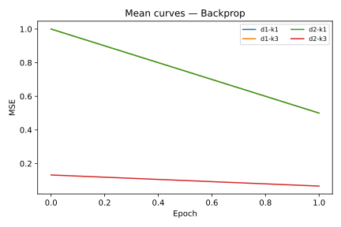

# FeedFlipNets


This repository provides minimal implementations of FeedFlipNets utilities.
Core modules live under `feedflipnets/` and experiment scripts under
`experiments/`.

Run the example experiment (package layout):

```bash
python experiments/ternary_dfa_experiment.py --depths 1 2 --freqs 1 3 \
    --outdir results/simple
```

Running the command with the default 500 epochs produces the following
final mean squared error (MSE) table (method `Backprop`), stored under
`results/simple`:

| depth/freq | 1 | 3 |
|-----------:|---:|---:|
| 1 | 0.1321 | 0.4936 |
| 2 | 0.1224 | 0.4883 |

Example plots:




See `results/simple/plots` for the generated heatmap and convergence curves.
Heavy binary artifacts are not stored. The example images are lightweight
SVG files for reference.

The legacy entry point `python ternary_dfa_experiment.py` continues to work and
forwards to the script under `experiments/`.

FeedFlipNets is a minimal research code base exploring "flip" style feedback in neural networks. The project accompanies the FeedFlipNets paper and provides reference implementations for running small‐scale experiments with direct feedback alignment (DFA) and quantized weights.

The repository currently contains a single script `ternary_dfa_experiment.py` which sweeps over network depth and training frequency on a toy time‑series regression problem. Additional scripts (not included here) were used in the paper to benchmark the approach on MNIST and the TinyStories language dataset.

## Dependencies

The experiments require Python 3.8+ and a few scientific Python packages:

```
pip install -r requirements.txt
```

The `requirements.txt` file lists the minimal packages: `numpy`, `matplotlib`, `pandas`, `scipy` and `pytest` (used for quick sanity tests).

## Running experiments

The general pattern for an experiment is

```
python ternary_dfa_experiment.py --depths <d1 d2 ...> --freqs <f1 f2 ...> --epochs <E> --outdir <results_dir>
```

This will train networks for the specified depths and frequencies, store curves and summary tables under `<results_dir>` and produce plots in `<results_dir>/plots`.

### Time‑series example

```
python ternary_dfa_experiment.py --depths 1 2 4 --freqs 1 3 5 --epochs 300 --outdir results/timeseries
```

### MNIST sweep

```
python ternary_dfa_experiment.py --dataset mnist --depths 2 4 --epochs 20 --outdir results/mnist
```

### Small MNIST example

This repository includes a short run used for testing the dataset loader.  It
trains for a single epoch on depth 1 with three methods:

```
python ternary_dfa_experiment.py --dataset mnist --depths 1 --freqs 1 \
    --epochs 1 --outdir results/mnist-mini --methods Backprop "Vanilla DFA" Momentum
```

For a very quick smoke test you can further limit the dataset size with
`--max-points <n>` which truncates the loaded sequence to ``n`` points.

The final mean squared error after one epoch is approximately:

| method       |  MSE |
|--------------|----:|
| Backprop     | 26.1 |
| Vanilla DFA  | 25.9 |
| Momentum     | 25.9 |

### TinyStories sweep

```
python ternary_dfa_experiment.py --dataset tinystories --depths 2 4 --epochs 50 --outdir results/tinystories
```

## Reproducing paper benchmarks

To reproduce the main benchmarks from the paper:

1. Install the dependencies as above.
2. Run the time‑series sweep command to match the regression results.
3. Repeat for MNIST and TinyStories using the respective dataset options or scripts.
4. Compare the final tables and plots in the `results/*/` folders with the ones reported in the paper.

## Experiment classes

The repository supports a variety of feedback alignment and quantized training variants. The table below summarises the main options and their rough performance relative to full precision backpropagation:

| Variant                            | Feedback    | Quantizer       | Calibration | Extras      | Rel. MSE↑ (%) / ΔAcc↓ (%) |
| ---------------------------------- | ----------- | --------------- | ----------- | ----------- | ------------------------- |
| FP Backprop (oracle)               | —           | FP              | —           | —           | 0                         |
| Vanilla DFA (random)               | random      | FP              | —           | —           | +5–10                     |
| Structured DFA (ortho)             | ortho       | FP              | —           | —           | +2–3                      |
| Ternary static Δ                   | random      | fixed           | —           | —           | +400                      |
| Ternary + adaptive Δ               | random      | adaptive+dither | —           | —           | +80                       |
| Ternary + adaptive + ortho B       | ortho       | adaptive+dither | —           | —           | +30                       |
| Ternary + adaptive + ortho B + cal | ortho       | adaptive+dither | Yes         | —           | **+5**                    |
| +Shadow                            | ortho       | sign(P)         | —           | Shadow      | +15                       |
| +Momentum                          | ortho       | adaptive+dither | —           | momentum    | *unstable*                |
| **Ternary DFA on Transformer/LLM** | block-ortho | adaptive+dither | Yes         | Hybrid opt. | (TBD)                     |

