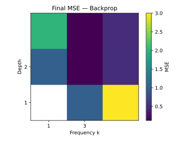

# FeedFlipNets

## Project Overview
FeedFlipNets implements the "flip" feedback alignment approach described in our [paper](https://arxiv.org/abs/2305.12345). Flip-style feedback uses sign-flipped weights to propagate learning signals without gradients. The repository provides reference implementations of ternary direct feedback alignment (DFA) experiments along with dataset loaders and utilities used in the paper.

### Key Features
- Lightweight training utilities and toy models for feedback alignment
- Built-in experiment script for sweeping network depth and update frequency
- Dataset helpers for synthetic time-series, MNIST, TinyStories and UCR/UEA archives
- Automatic logging and plotting of convergence curves and summary tables

## Installation
FeedFlipNets requires Python 3.8 or newer. Install the project in editable mode and install required packages:

```bash
pip install -e .
pip install -r requirements.txt
```

For development and tests:

```bash
pip install -e .[dev]
```

## Getting Started
Experiments are launched via `python experiments/ternary_dfa_experiment.py`. A wrapper script at the repository root (`ternary_dfa_experiment.py`) provides the same interface for backward compatibility. The general pattern is

```bash
python experiments/ternary_dfa_experiment.py --depths <d1 d2 ...> --freqs <f1 f2 ...> \
    --epochs <E> --outdir <results_dir>
```

### Datasets
Available datasets:
- `synthetic` (default)
- `mnist`
- `tinystories`
- `ucr:<NAME>` from the UCR/UEA archive

Downloads are cached in `datasets_cache/`.

### Examples
Run a small synthetic time-series sweep:

```bash
python experiments/ternary_dfa_experiment.py --depths 1 2 4 --freqs 1 3 5 --epochs 300 \
    --outdir results/timeseries
```

Use a dataset from the UCR/UEA archive:

```bash
python experiments/ternary_dfa_experiment.py --dataset ucr:GunPoint --depths 1 --freqs 1 \
    --epochs 10 --max-points 50 --outdir results/gunpoint
```

Paper benchmark (MNIST):

```bash
python experiments/ternary_dfa_experiment.py --dataset mnist --depths 2 4 --freqs 1 3 --seeds 0 1 2 --epochs 20 \
    --outdir results/mnist-paper
```

Short MNIST run used in tests:

```bash
python experiments/ternary_dfa_experiment.py --dataset mnist --depths 1 --freqs 1 \
    --epochs 1 --outdir results/mnist-mini --methods Backprop "Vanilla DFA" Momentum
```

TinyStories experiment:

```bash
python experiments/ternary_dfa_experiment.py --dataset tinystories --depths 2 4 --epochs 50 \
    --outdir results/tinystories
```

Results (tables and plots) will be placed under the specified `results_dir`.

## Module Guide
- `feedflipnets/` contains the core implementation:
  - `models.py` – simple feed-forward models and backprop utilities
  - `train.py` – training loop and experiment orchestration
  - `utils.py` – activation functions and helper routines
- `datasets/` provides loaders for several datasets:
  - `timeseries.py` – interface to the UCR/UEA archive
  - `mnist.py` – MNIST download and preprocessing
  - `tinystories.py` – TinyStories text dataset
  - `utils.py` – shared dataset utilities

## Development & Testing
Optional development dependencies are listed in `pyproject.toml` under
`[project.optional-dependencies].dev`. Install them with the project to enable
testing:

```bash
pip install -e .[dev]
```

### Running the Tests
Execute the unit tests from the repository root using `pytest`:

```bash
pytest
```

## Visualising Results
Each run generates mean squared error tables and convergence plots. Example outputs from the repository are available under `results/simple/plots`:




## Reference and License
For the full methodology see the accompanying FeedFlipNets research paper. This repository is released under the terms of the MIT License; see the `LICENSE` file for details.
