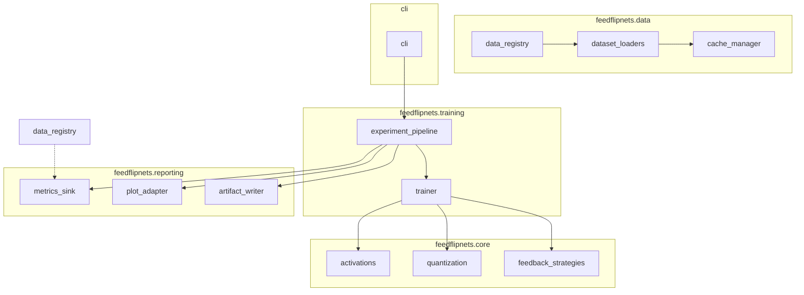

# Target Architecture – FeedFlipNets vNext

## Guiding Principles
1. **Deterministic experiments** – isolate data acquisition, training, and reporting to enable reproducible runs.  
2. **Pluggable strategies** – decouple feedback alignment variants from trainer orchestration.  
3. **Automation first** – every surface callable from CLI, API, or CI with the same entrypoints.

## Module Map

## Dependency Rules
- `feedflipnets.core` contains pure numpy operations with **no IO** or plotting.  
- `feedflipnets.data` may depend on `core` for normalization utilities but **never** on training/reporting.  
- `feedflipnets.training` orchestrates batches using interfaces from `core` and `data`; it can emit events to `reporting` via abstract ports.  
- `feedflipnets.reporting` depends on core types only; plotting is optional and headless-safe.  
- CLI/experiments import only `training` and `reporting` interfaces.

## Public APIs
- `feedflipnets.core.feedback` exposes `FeedbackStrategy` protocol with `compute_updates(activations, error)` signature.  
- `feedflipnets.training.trainer.Trainer.run(config, data_iter, callbacks)` returns structured `RunResult`.  
- `feedflipnets.data.registry.get_dataset(name, options)` returns dataset metadata + loader callable.  
- `feedflipnets.reporting.metrics.emit(event)` writes to JSONL/CSV sinks; CLI chooses sinks via config.

## Data Flow
1. CLI parses config ➜ resolves dataset via registry (ensures cached assets, offline checks).  
2. Trainer pulls batches via iterator, applies quantisation/feedback strategy, records metrics.  
3. Reporting callbacks serialize metrics and optionally plot via adapter (skippable in CI).  
4. Pipelines capture metadata (git SHA, config, dataset manifest) for reproducibility.

## Non-Functional Guardrails
- All modules pure-Python/NumPy; GPU/accelerator hooks implemented via optional adapters.  
- Deterministic random seeds enforced by trainer; dataset loader returns provenance manifest.  
- Logging uses structured JSON to integrate with experiment trackers.
